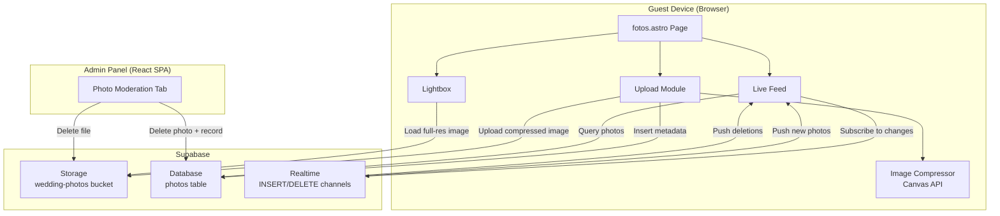

# Design Document: Live Photo Gallery

## Overview

The Live Photo Gallery is a guest-facing Astro page at `/fotos` that enables wedding attendees to upload and view photos in real-time during the event. It leverages Supabase Storage for image hosting, Supabase Database for metadata, and Supabase Realtime for live feed updates.

The architecture follows the existing project patterns: vanilla TypeScript in Astro `<script>` tags for the guest-facing page (consistent with `mesa.astro`), and React components in the admin panel for moderation. The page uses the wedding theme (olive/beige/gold, Playfair Display + Montserrat) and is fully mobile-first.

### Key Design Decisions

1. **Client-side image compression** using the Canvas API (no external library) to resize images to max 1920px before upload, reducing bandwidth and storage costs.
2. **Supabase Realtime subscriptions** on the `photos` table for INSERT/DELETE events to push live updates to all connected clients.
3. **Masonry grid layout** implemented with CSS columns for simplicity and performance (no JS layout library needed).
4. **Lightbox with swipe gestures** using native touch events (no external library) for mobile navigation.
5. **Infinite scroll** with Intersection Observer API for paginated loading.
6. **Thumbnail generation** via Supabase Storage transform URLs (width parameter) rather than generating separate thumbnail files.

## Architecture



### Data Flow

1. **Upload Flow**: Guest enters name → selects photo → Canvas API compresses to ≤1920px → upload to Supabase Storage → insert Photo_Record → Realtime broadcasts INSERT to all clients.
2. **View Flow**: Page loads → fetch initial 20 photos (descending by `created_at`) → subscribe to Realtime → new photos prepended to grid → infinite scroll loads older batches.
3. **Moderation Flow**: Admin authenticates → views all photos → selects photo for deletion → delete from Storage + Database → Realtime broadcasts DELETE → photo removed from all connected clients.

## Components and Interfaces

### 1. `fotos.astro` — Main Page

The Astro page providing the HTML structure, styles, and inline `<script>` with all client-side logic.

**Sections:**
- Header with page title and navigation back to main site
- Guest name input/display bar
- Upload button (fixed position FAB)
- Upload modal with file picker and progress
- Masonry photo grid (Live Feed)
- Lightbox overlay

### 2. Upload Module (TypeScript in `<script>`)

```typescript
interface UploadModule {
  openFilePicker(): void;
  compressImage(file: File, maxDimension: number): Promise<Blob>;
  uploadPhoto(blob: Blob, guestName: string): Promise<PhotoRecord>;
  validateFile(file: File): { valid: boolean; error?: string };
}
```

**Responsibilities:**
- File validation (type, size)
- Client-side compression via Canvas API
- Upload to Supabase Storage with unique filename (`{timestamp}_{random}.jpg`)
- Insert metadata row into `photos` table
- Progress tracking and error handling

### 3. Live Feed (TypeScript in `<script>`)

```typescript
interface LiveFeed {
  loadInitialPhotos(limit: number, offset: number): Promise<PhotoRecord[]>;
  subscribeToChanges(): void;
  prependPhoto(photo: PhotoRecord): void;
  removePhoto(photoId: string): void;
  loadMore(): void;
}
```

**Responsibilities:**
- Initial data fetch with pagination
- Realtime subscription management
- DOM manipulation for masonry grid
- Infinite scroll via Intersection Observer
- Lazy loading images with `loading="lazy"`

### 4. Lightbox (TypeScript in `<script>`)

```typescript
interface Lightbox {
  open(photoId: string): void;
  close(): void;
  navigateNext(): void;
  navigatePrev(): void;
  handleSwipe(direction: 'left' | 'right'): void;
}
```

**Responsibilities:**
- Full-screen overlay with full-resolution image
- Touch swipe detection for mobile navigation
- Keyboard navigation (arrow keys, Escape)
- Preload adjacent images

### 5. Image Compressor (TypeScript utility)

```typescript
interface ImageCompressor {
  compress(file: File, options: CompressionOptions): Promise<Blob>;
}

interface CompressionOptions {
  maxDimension: number;  // 1920 for upload, could be configurable
  quality: number;       // 0.85 JPEG quality
  outputFormat: 'image/jpeg';
}
```

**Responsibilities:**
- Load image into an off-screen canvas
- Calculate scaled dimensions preserving aspect ratio
- Export as JPEG blob with specified quality
- Handle HEIC by reading via FileReader (browser support) or falling back to original

### 6. Admin Moderation Panel (React component in `admin/`)

```typescript
interface PhotoModerationProps {
  supabaseUrl: string;
  supabaseAnonKey: string;
}

interface PhotoModerationState {
  photos: PhotoRecord[];
  loading: boolean;
  deleting: Set<string>;
}
```

**Responsibilities:**
- List all photos with metadata
- Delete photo (Storage file + Database record)
- Real-time updates when new photos arrive
- Confirmation dialog before deletion

### 7. Supabase Client Initialization

A shared utility module at `basics/src/scripts/supabase.ts`:

```typescript
import { createClient } from '@supabase/supabase-js';

const supabaseUrl = import.meta.env.PUBLIC_SUPABASE_URL;
const supabaseAnonKey = import.meta.env.PUBLIC_SUPABASE_ANON_KEY;

export const supabase = createClient(supabaseUrl, supabaseAnonKey);
```

## Data Models

### Supabase `photos` Table

| Column | Type | Constraints | Description |
|--------|------|-------------|-------------|
| `id` | `uuid` | PRIMARY KEY, default `gen_random_uuid()` | Unique photo identifier |
| `storage_path` | `text` | NOT NULL | Path within the `wedding-photos` bucket |
| `uploader_name` | `text` | NOT NULL | Display name of the guest who uploaded |
| `created_at` | `timestamptz` | NOT NULL, default `now()` | Upload timestamp |
| `is_visible` | `boolean` | NOT NULL, default `true` | Visibility flag for moderation |

### SQL Schema

```sql
CREATE TABLE photos (
  id UUID PRIMARY KEY DEFAULT gen_random_uuid(),
  storage_path TEXT NOT NULL,
  uploader_name TEXT NOT NULL,
  created_at TIMESTAMPTZ NOT NULL DEFAULT now(),
  is_visible BOOLEAN NOT NULL DEFAULT true
);

-- Enable Realtime
ALTER PUBLICATION supabase_realtime ADD TABLE photos;

-- RLS Policies
ALTER TABLE photos ENABLE ROW LEVEL SECURITY;

-- Anyone can read visible photos
CREATE POLICY "Public can view visible photos"
  ON photos FOR SELECT
  USING (is_visible = true);

-- Anyone can insert (anonymous uploads)
CREATE POLICY "Anyone can upload photos"
  ON photos FOR INSERT
  WITH CHECK (true);

-- Only service role can delete (admin moderation via service key or RLS bypass)
CREATE POLICY "Service role can delete"
  ON photos FOR DELETE
  USING (auth.role() = 'service_role');
```

### Supabase Storage Bucket Configuration

- **Bucket name**: `wedding-photos`
- **Public access**: Enabled for reads (public URLs for images)
- **File size limit**: 10 MB
- **Allowed MIME types**: `image/jpeg`, `image/png`, `image/heic`, `image/webp`
- **Transform support**: Enabled (for thumbnail generation via URL params)

### Storage Path Convention

```
wedding-photos/{timestamp}_{randomId}.jpg
```

Example: `wedding-photos/1719849600000_a1b2c3d4.jpg`

### LocalStorage Schema

```typescript
interface GuestLocalStorage {
  'photo-gallery-guest-name': string;  // The guest's display name
}
```

### PhotoRecord TypeScript Interface

```typescript
interface PhotoRecord {
  id: string;
  storage_path: string;
  uploader_name: string;
  created_at: string;
  is_visible: boolean;
}
```

### URL Generation

- **Thumbnail (grid)**: `{SUPABASE_URL}/storage/v1/render/image/public/wedding-photos/{path}?width=400`
- **Full resolution (lightbox)**: `{SUPABASE_URL}/storage/v1/object/public/wedding-photos/{path}`


## Correctness Properties

*A property is a characteristic or behavior that should hold true across all valid executions of a system—essentially, a formal statement about what the system should do. Properties serve as the bridge between human-readable specifications and machine-verifiable correctness guarantees.*

### Property 1: File validation accepts only valid types and sizes

*For any* file with a MIME type and a size in bytes, the `validateFile` function SHALL return `valid: true` if and only if the MIME type is one of `image/jpeg`, `image/png`, `image/heic`, `image/webp` AND the file size is less than or equal to 10,485,760 bytes (10 MB). Otherwise it SHALL return `valid: false` with an appropriate error message.

**Validates: Requirements 1.2, 1.3**

### Property 2: Generated filenames are unique

*For any* set of 1000 filenames produced by the `generateFilename` function (called with distinct timestamps or random seeds), all filenames in the set SHALL be unique (no two filenames are equal).

**Validates: Requirements 1.4**

### Property 3: Guest name localStorage round-trip

*For any* non-empty string used as a guest display name, storing it via the `setGuestName` function and then retrieving it via `getGuestName` SHALL return the exact same string.

**Validates: Requirements 2.2**

### Property 4: Photos are sorted in descending chronological order

*For any* array of PhotoRecord objects with distinct `created_at` timestamps, the `sortPhotosDescending` function SHALL return them ordered such that for every adjacent pair (photo[i], photo[i+1]), `photo[i].created_at >= photo[i+1].created_at`.

**Validates: Requirements 3.1**

### Property 5: Photo card rendering includes uploader name and relative time

*For any* PhotoRecord with a non-empty `uploader_name` and a valid `created_at` timestamp, the `renderPhotoCard` function SHALL produce HTML that contains the `uploader_name` string and a non-empty relative time string (e.g., "há 2 min", "há 1 hora").

**Validates: Requirements 3.5**

### Property 6: Image dimension scaling preserves aspect ratio and enforces max dimension

*For any* image with width W > 0 and height H > 0, the `computeScaledDimensions(W, H, 1920)` function SHALL return dimensions (w, h) where:
- `max(w, h) <= 1920`
- If `max(W, H) <= 1920`, then `w == W` and `h == H` (no scaling needed)
- The aspect ratio is preserved: `|w/h - W/H| < 0.01`

**Validates: Requirements 4.1**

### Property 7: Storage URL generation produces correct thumbnail and full-res URLs

*For any* non-empty storage path string, the `getThumbnailUrl(path)` function SHALL return a URL containing `width=400` as a query parameter, and the `getFullResUrl(path)` function SHALL return a URL containing the path as a direct object reference without resize parameters.

**Validates: Requirements 4.2, 4.3**

## Error Handling

### Upload Errors

| Error Scenario | Handling | User Feedback |
|---|---|---|
| Invalid file type | Reject before upload | "Formato não suportado. Use JPEG, PNG, HEIC ou WebP." |
| File too large (>10MB) | Reject before upload | "Ficheiro demasiado grande. Máximo: 10 MB." |
| Network failure during upload | Catch fetch error | "Erro de rede. Tente novamente." + Retry button |
| Supabase Storage error | Catch API error | "Não foi possível enviar a foto. Tente novamente." |
| Database insert failure | Catch API error, clean up uploaded file | "Erro ao guardar. Tente novamente." |
| Canvas compression failure (e.g., HEIC not supported) | Fall back to original file if under size limit | Silent fallback, no user message |

### Realtime Connection Errors

| Error Scenario | Handling | User Feedback |
|---|---|---|
| Realtime subscription fails | Retry with exponential backoff (3 attempts) | Silent — feed still works via manual refresh |
| Realtime disconnection | Auto-reconnect (Supabase client handles this) | Subtle "Reconectando..." indicator after 5s |
| Supabase client init failure | Catch on page load | "Galeria indisponível de momento." + hide upload |

### Admin Moderation Errors

| Error Scenario | Handling | User Feedback |
|---|---|---|
| Delete fails (Storage) | Show error, don't remove from UI | "Erro ao eliminar ficheiro." |
| Delete fails (Database) | Show error, don't remove from UI | "Erro ao eliminar registo." |
| Auth token expired | Redirect to login | "Sessão expirada. Faça login novamente." |

### Edge Cases

- **HEIC format**: Not all browsers support HEIC in Canvas. If `createImageBitmap` fails, attempt upload of original file if under 10MB, otherwise show format error.
- **Concurrent uploads**: Queue multiple file uploads sequentially to avoid overwhelming the connection.
- **Rapid Realtime events**: Debounce DOM updates to avoid layout thrashing (batch updates within 100ms window).
- **Empty gallery**: Show a friendly empty state with upload CTA: "Seja o primeiro a partilhar uma foto!"

## Testing Strategy

### Unit Tests (Example-Based)

Focus on specific scenarios and edge cases:

- File picker trigger on button click
- Upload progress indicator visibility
- Success/error message display after upload
- Guest name prompt on first visit
- Upload button disabled without name
- Lightbox open/close behavior
- Swipe gesture detection
- Infinite scroll trigger
- Admin authentication gate
- Offline message when Supabase unavailable
- Navigation links presence

### Property-Based Tests

Using **fast-check** as the property-based testing library (already compatible with the project's TypeScript setup).

Each property test runs a minimum of **100 iterations** with randomly generated inputs.

| Property | Test Description | Tag |
|----------|-----------------|-----|
| Property 1 | Generate random MIME types and file sizes, verify validation | Feature: live-photo-gallery, Property 1: File validation accepts only valid types and sizes |
| Property 2 | Generate 1000 filenames, verify uniqueness | Feature: live-photo-gallery, Property 2: Generated filenames are unique |
| Property 3 | Generate random strings, store/retrieve from mock localStorage | Feature: live-photo-gallery, Property 3: Guest name localStorage round-trip |
| Property 4 | Generate random PhotoRecord arrays, verify sort order | Feature: live-photo-gallery, Property 4: Photos are sorted in descending chronological order |
| Property 5 | Generate random PhotoRecords, verify rendered HTML content | Feature: live-photo-gallery, Property 5: Photo card rendering includes uploader name and relative time |
| Property 6 | Generate random width/height pairs, verify scaling output | Feature: live-photo-gallery, Property 6: Image dimension scaling preserves aspect ratio and enforces max dimension |
| Property 7 | Generate random storage paths, verify URL structure | Feature: live-photo-gallery, Property 7: Storage URL generation produces correct thumbnail and full-res URLs |

### Integration Tests

- Upload flow end-to-end (file → Storage → Database → Realtime)
- Realtime subscription receives INSERT events
- Realtime subscription receives DELETE events
- Admin deletion removes file from Storage and record from Database
- Pagination returns correct batches

### Smoke Tests

- Supabase client initializes with env vars
- `wedding-photos` bucket exists and is accessible
- `photos` table has correct schema
- Realtime is enabled on `photos` table
- `/fotos` page is accessible at correct URL path

### Test File Structure

```
basics/src/scripts/__tests__/
  photo-gallery.test.ts        # Unit tests
  photo-gallery.property.test.ts  # Property-based tests
```
