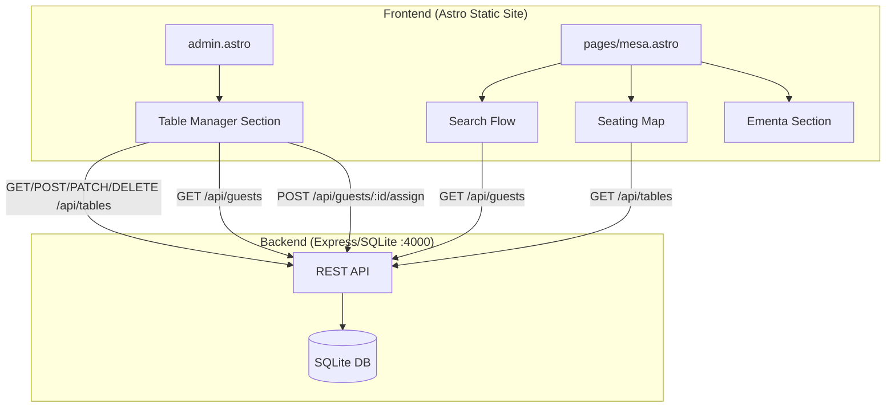
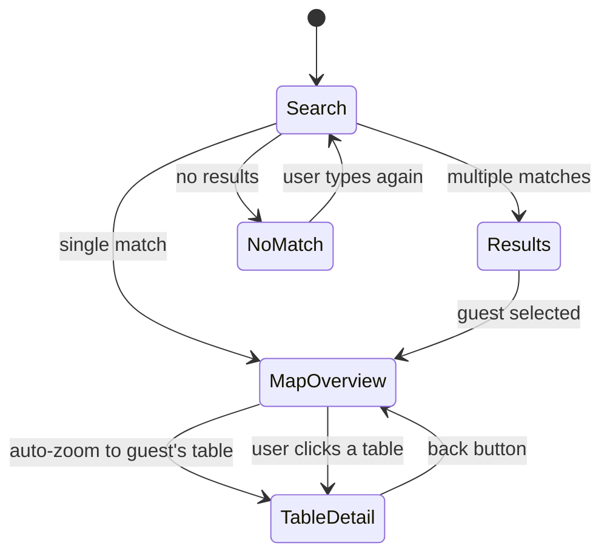

# Design Document: Table Seating Experience

## Overview

This feature adds two interconnected experiences to the wedding website:

1. **Admin Table Manager** — A new section within the existing `admin.astro` page that provides table CRUD, guest-to-table assignment via drag-and-drop or dropdowns, and a visual seating overview with color-coded occupancy.

2. **Guest Table Finder** — A new Astro page (`/mesa`) where guests search by name and experience an immersive animated seating map. The map starts as a full venue overview, then smoothly zooms into the guest's assigned table showing their tablemates. The page also displays the wedding menu (ementa).

Both experiences consume the existing Express/SQLite backend API on port 4000 — no new server endpoints are needed.

### Key Design Decisions

- **No framework additions**: Both pages use vanilla JS with Astro's `<script>` tags, matching the existing admin page pattern. No React/Vue needed.
- **CSS-driven animations**: The seating map zoom uses CSS `transform: scale()` + `translate()` with `transition` for smooth 60fps animations. No animation libraries.
- **Single data fetch pattern**: The Table Finder fetches all guests and tables once on search, then operates on the client-side data for instant interactions.
- **Progressive enhancement**: The seating map works without animations on reduced-motion preferences.

## Architecture



### Page Structure

| Page | Path | Purpose |
|------|------|---------|
| Admin (existing) | `/admin` | Extended with Table Manager section |
| Table Finder (new) | `/mesa` | Guest-facing search + animated map + ementa |

### Data Flow

1. **Admin Table Manager**: Fetches tables and guests on load. All mutations go through the API and optimistically update the UI.
2. **Table Finder**: Guest enters name → client fetches `GET /api/guests` → filters locally → on match, fetches `GET /api/tables` → renders seating map → animates to assigned table.

## Components and Interfaces

### Admin Table Manager (added to admin.astro)

The Table Manager is a new tab/section within the existing admin dashboard, activated by a tab button in the dashboard header.

```
┌─────────────────────────────────────────────────┐
│  Dashboard Header                               │
│  [Confirmações] [Mesas]  ← tab navigation       │
├─────────────────────────────────────────────────┤
│  Stats: Total Tables | Assigned | Unassigned    │
├─────────────────────────────────────────────────┤
│  ┌──────────────────┐  ┌──────────────────────┐ │
│  │ Table List       │  │ Visual Grid          │ │
│  │ + Add Table Form │  │ (color-coded cards)  │ │
│  │ - Edit/Delete    │  │                      │ │
│  │ - Assign guests  │  │                      │ │
│  └──────────────────┘  └──────────────────────┘ │
└─────────────────────────────────────────────────┘
```

**Key UI Components:**
- `TabNavigation` — Switches between Confirmações and Mesas views
- `TableForm` — Inline form for creating/editing tables (name + capacity)
- `TableList` — List of tables with edit/delete actions and guest assignment dropdowns
- `SeatingGrid` — Visual card grid showing tables with occupancy color coding
- `GuestAssignmentPanel` — Dropdown or list for assigning unassigned guests to tables

### Guest Table Finder (new page: mesa.astro)

```
┌─────────────────────────────────────────────────┐
│  Header: "Encontre a sua Mesa"                  │
│  Search Input: [Nome do convidado...]           │
│  Results dropdown (if multiple matches)         │
├─────────────────────────────────────────────────┤
│                                                 │
│  ┌─────────────────────────────────────────┐    │
│  │         SEATING MAP VIEWPORT            │    │
│  │                                         │    │
│  │   ○ Mesa 1    ○ Mesa 2    ○ Mesa 3     │    │
│  │                                         │    │
│  │   ○ Mesa 4    ○ Mesa 5    ○ Mesa 6     │    │
│  │                                         │    │
│  │   ○ Mesa 7    ○ Mesa 8    ○ Mesa 9     │    │
│  │                                         │    │
│  └─────────────────────────────────────────┘    │
│                                                 │
│  [← Ver todas as mesas]  (back button)         │
├─────────────────────────────────────────────────┤
│  EMENTA SECTION                                 │
│  Entradas | Prato Principal | Sobremesa         │
└─────────────────────────────────────────────────┘
```

**State Machine for Table Finder:**



### Animation Architecture

The seating map uses a single container with CSS transforms for zoom/pan:

```javascript
// Conceptual animation approach
const mapContainer = document.querySelector('.seating-map-inner');

// Overview state
mapContainer.style.transform = 'scale(1) translate(0, 0)';

// Zoom to specific table
const table = document.querySelector(`[data-table-id="${tableId}"]`);
const rect = table.getBoundingClientRect();
const containerRect = mapContainer.getBoundingClientRect();

// Calculate transform to center the target table
const scaleTarget = 2.5;
const translateX = -(rect.left - containerRect.left - containerRect.width/2 + rect.width/2);
const translateY = -(rect.top - containerRect.top - containerRect.height/2 + rect.height/2);

mapContainer.style.transform = `scale(${scaleTarget}) translate(${translateX}px, ${translateY}px)`;
```

**CSS transitions applied:**
```css
.seating-map-inner {
    transition: transform 0.8s cubic-bezier(0.4, 0, 0.2, 1);
    transform-origin: center center;
}
```

This approach gives smooth 60fps animations because:
- `transform` is GPU-accelerated (compositor-only property)
- Single transition property, no layout thrashing
- `cubic-bezier(0.4, 0, 0.2, 1)` matches Material Design's standard easing (fast start, gentle end)

### Table Detail View (zoomed state)

When zoomed in, the detail overlay fades in on top showing:
- Table name (large heading)
- Guest names arranged in a circle around a table illustration
- The current guest's name highlighted with gold accent

```css
.table-detail-overlay {
    opacity: 0;
    transition: opacity 0.4s ease 0.5s; /* delay until zoom completes */
}
.table-detail-overlay.visible {
    opacity: 1;
}
```

## Data Models

### Existing Database Schema (no changes needed)

```sql
-- Tables table
CREATE TABLE tables (
    id TEXT PRIMARY KEY,
    name TEXT,
    capacity INTEGER
);

-- Guests table (relevant fields)
CREATE TABLE guests (
    id TEXT PRIMARY KEY,
    nome TEXT,
    mesa_id TEXT,  -- FK to tables.id, nullable
    -- ... other fields
);
```

### Client-Side Data Structures

```typescript
// Fetched from API
interface Table {
    id: string;
    name: string;
    capacity: number;
}

interface Guest {
    id: string;
    nome: string;
    mesa_id: string | null;
    // ... other fields from API
}

// Computed client-side
interface TableWithOccupancy {
    table: Table;
    guests: Guest[];
    occupancy: number;       // guests.length
    isFull: boolean;         // occupancy >= capacity
    fillLevel: 'empty' | 'partial' | 'full';
}

// Seating map state
interface SeatingMapState {
    view: 'overview' | 'detail';
    selectedTableId: string | null;
    highlightedGuestId: string | null;
    tables: TableWithOccupancy[];
}
```

### API Integration Map

| Action | Method | Endpoint | Body |
|--------|--------|----------|------|
| List tables | GET | `/api/tables` | — |
| Create table | POST | `/api/tables` | `{ name, capacity }` |
| Update table | PATCH | `/api/tables/:id` | `{ name?, capacity? }` |
| Delete table | DELETE | `/api/tables/:id` | — |
| List guests | GET | `/api/guests` | — |
| Assign guest | POST | `/api/guests/:id/assign` | `{ table_id }` |
| Unassign guest | POST | `/api/guests/:id/assign` | `{ table_id: null }` |

## Correctness Properties

*A property is a characteristic or behavior that should hold true across all valid executions of a system — essentially, a formal statement about what the system should do. Properties serve as the bridge between human-readable specifications and machine-verifiable correctness guarantees.*

### Property 1: Guest-to-table grouping correctness

*For any* set of tables and guests, grouping guests by their `mesa_id` field SHALL produce an association where each table's guest list contains exactly the guests whose `mesa_id` matches that table's `id`, and no guest appears in more than one table's list.

**Validates: Requirements 1.1, 2.5, 3.1, 6.1**

### Property 2: Guest assignment classification

*For any* list of guests, partitioning them into "assigned" and "unassigned" groups SHALL produce two disjoint sets where every guest with a non-null `mesa_id` is in the assigned set, every guest with a null `mesa_id` is in the unassigned set, and the sum of both sets equals the total guest count.

**Validates: Requirements 2.1, 3.3**

### Property 3: Capacity warning correctness

*For any* table with a defined capacity and a set of assigned guests, the capacity warning SHALL be active if and only if the number of assigned guests is greater than or equal to the table's capacity.

**Validates: Requirements 2.4**

### Property 4: Table fill-level classification

*For any* table with capacity > 0, the fill-level classification SHALL be "empty" when occupancy is 0, "full" when occupancy >= capacity, and "partial" otherwise. These three classifications are mutually exclusive and exhaustive.

**Validates: Requirements 3.2**

### Property 5: Case-insensitive partial name search

*For any* list of guests and any non-empty search query string, the filtered results SHALL contain exactly those guests whose `nome` field contains the query as a substring when both are compared case-insensitively.

**Validates: Requirements 4.2**

### Property 6: Current guest highlighting

*For any* table detail view rendered for a specific guest, exactly one guest name in the displayed list SHALL be marked as highlighted, and that name SHALL correspond to the searching guest's `id`.

**Validates: Requirements 6.2**

## Error Handling

### Admin Table Manager

| Error Scenario | Handling |
|----------------|----------|
| API unreachable (network error) | Show toast: "Erro de ligação. Verifique a sua rede." Retry button. |
| API returns 4xx/5xx on table create | Show inline error below form: "Não foi possível criar a mesa. [error detail]" |
| API returns error on guest assign | Show toast with error, revert optimistic UI update |
| Table delete with assigned guests | Confirm dialog: "Esta mesa tem X convidados. Deseja continuar?" Backend already unassigns guests on delete. |

### Guest Table Finder

| Error Scenario | Handling |
|----------------|----------|
| API unreachable | Show message: "Não foi possível carregar os dados. Tente novamente." with retry button. |
| Guest has no table assigned | Show friendly message: "A sua mesa ainda não foi atribuída. Volte mais tarde!" |
| No search results | Show: "Não encontrámos esse nome. Verifique a ortografia ou tente o nome completo." |
| Empty tables data | Show seating map with placeholder: "O mapa de mesas será disponibilizado em breve." |

### Reduced Motion Handling

```javascript
const prefersReducedMotion = window.matchMedia('(prefers-reduced-motion: reduce)').matches;

if (prefersReducedMotion) {
    // Skip zoom animation, show detail view directly
    mapContainer.style.transition = 'none';
    detailOverlay.style.transition = 'none';
}
```

## Testing Strategy

### Property-Based Tests

The feature includes pure data transformation functions that are well-suited for property-based testing:

- **Library**: [fast-check](https://github.com/dubzzz/fast-check) (JavaScript PBT library)
- **Configuration**: Minimum 100 iterations per property
- **Tag format**: `Feature: table-seating-experience, Property {N}: {description}`

Functions to test with PBT:
1. `groupGuestsByTable(tables, guests)` → Property 1
2. `partitionGuestsByAssignment(guests)` → Property 2
3. `isOverCapacity(table, assignedCount)` → Property 3
4. `getTableFillLevel(occupancy, capacity)` → Property 4
5. `searchGuestsByName(guests, query)` → Property 5
6. `getHighlightedGuestId(guests, currentGuestId)` → Property 6

### Unit Tests (Example-Based)

- Table CRUD form submission triggers correct API calls
- Guest assignment dropdown updates correctly
- Search input debouncing works (doesn't fire on every keystroke)
- No-match state displays correct message
- Back button returns to overview state
- Ementa section renders all course categories
- ARIA labels are present on interactive elements
- Keyboard navigation (Tab, Enter, Escape) works for search and table selection

### Integration Tests

- Full flow: create table → assign guest → verify in seating grid
- Full flow: search guest → see map → zoom to table → see tablemates
- API error handling: mock 500 responses, verify error UI
- Responsive: verify no horizontal scroll at 320px, 768px, 1920px

### Visual/Manual Tests

- Animation smoothness at 60fps (Chrome DevTools Performance tab)
- Color contrast meets WCAG AA for all text on colored backgrounds
- Touch targets are at least 44x44px on mobile
- Reduced motion preference disables animations
