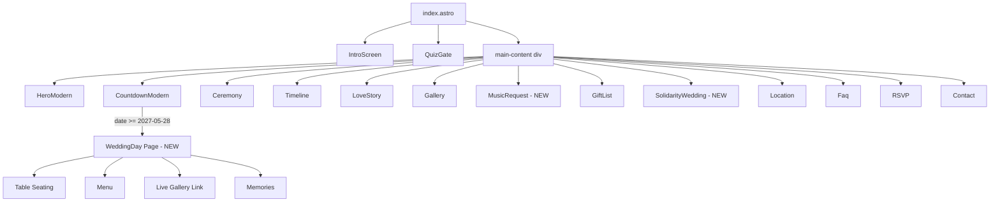
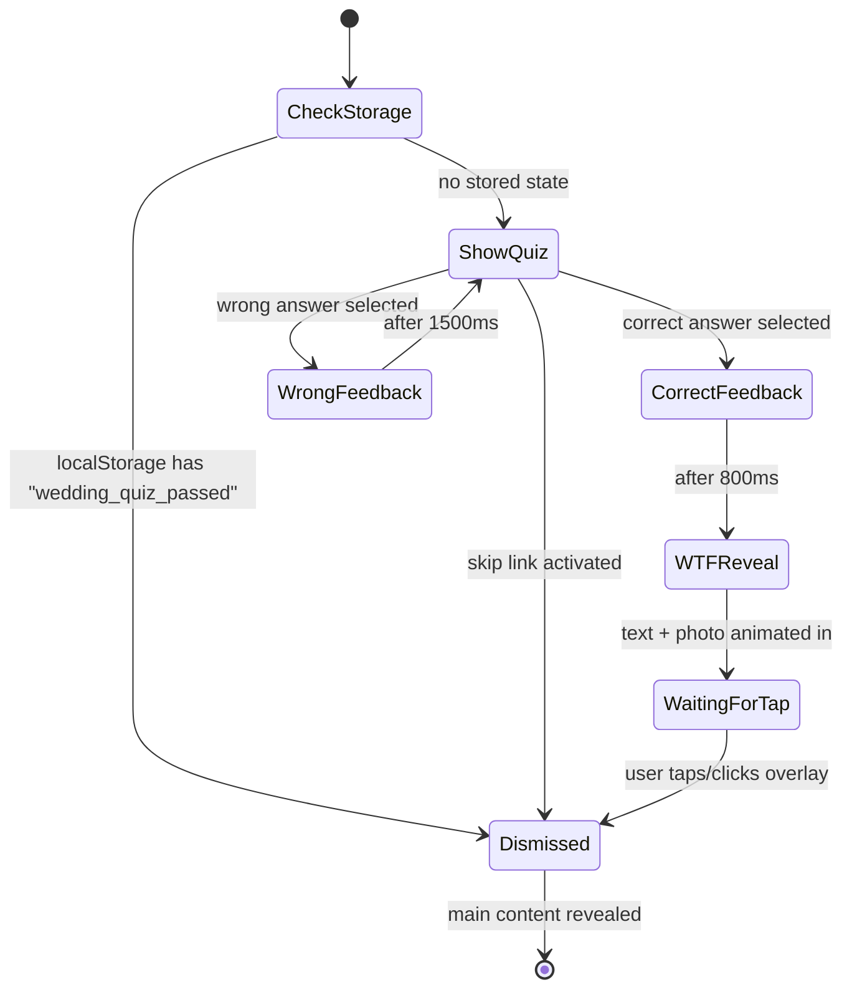
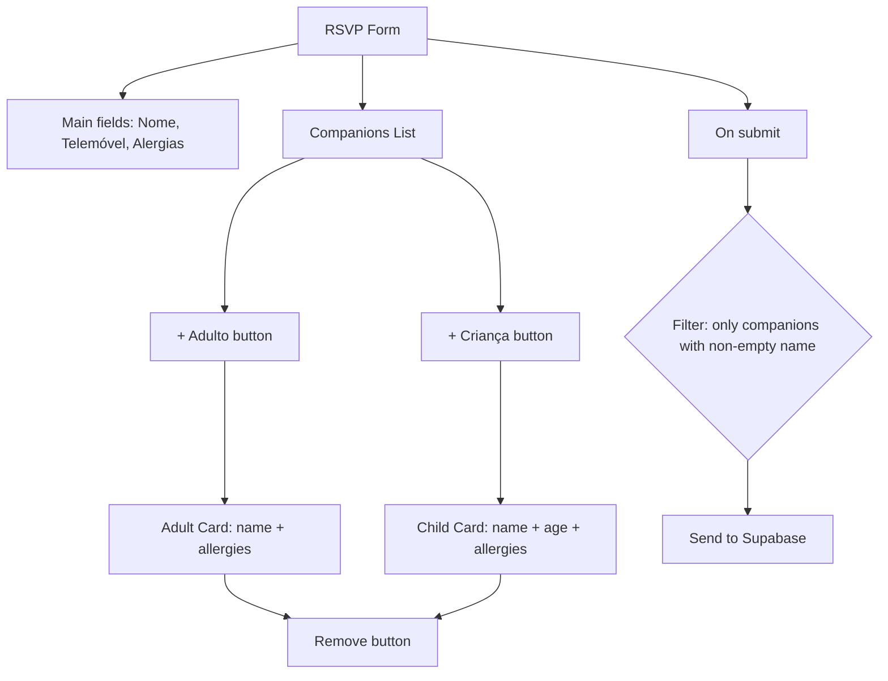

# Design Document — Wedding Site Improvements

## Overview

This design covers a set of UX and content improvements to the Tânia & Miguel wedding website built with Astro, Tailwind CSS, and Supabase. The changes span multiple areas: enhancing the quiz gate interaction with a photo reveal and skip option, fixing typographic consistency across all sections, updating the countdown section with textured backgrounds and wedding-day logic, restructuring existing sections (LoveStory, Gallery, RSVP, GiftList, FAQ), creating new sections (MusicRequest, SolidarityWedding), adding a WeddingDay page, and correcting the footer date.

The site is a single-page Astro application (`basics/`) deployed to GitHub Pages at `/casamento_taniaemiguel` base path. It uses `@supabase/supabase-js` for backend operations (RSVP, music requests), Tailwind CSS for styling with a custom olive/beige design system, and Google Fonts (Playfair Display, Montserrat, Mrs Saint Delafield). An admin panel (`admin/`) uses React + Vite for guest management.

## Architecture

### High-Level Structure



### Technology Stack (unchanged)

- **Framework**: Astro 5.x (static site generation)
- **Styling**: Tailwind CSS 3.4 + custom design system in `global.css`
- **Backend**: Supabase (PostgreSQL + REST API)
- **Fonts**: Google Fonts (Playfair Display, Montserrat, Mrs Saint Delafield)
- **Testing**: Vitest + fast-check (property-based testing)
- **Deployment**: GitHub Pages with base path `/casamento_taniaemiguel`

### Client-Side JavaScript Strategy

All interactive features use Astro's `<script>` tags (bundled as modules at build time). No framework hydration is needed for the main site — vanilla JS handles:
- Quiz gate state machine and animations
- Countdown timer with timezone-aware date logic
- FAQ accordion behavior
- RSVP companion form dynamic cards
- Music request form submission
- Lightbox gallery navigation

## Components and Interfaces

### Modified Components

| Component | File | Changes |
|-----------|------|---------|
| QuizGate | `src/components/QuizGate.astro` | Add skip link, modify WTF reveal to require tap-to-advance |
| HeroModern | `src/components/HeroModern.astro` | Add contrast treatment, verify z-index layering, font sizing |
| CountdownModern | `src/components/CountdownModern.astro` | Add textured background, wax seal logo, wedding-day conditional logic |
| LoveStory | `src/sections/LoveStory.astro` | Update subtitle to "Um pouco mais sobre nós" |
| Gallery | `src/sections/Gallery.astro` | Remove live gallery CTA link |
| RSVP | `src/sections/RSVP.astro` | Update field labels/placeholders, restructure companion form |
| GiftList | `src/sections/GiftList.astro` | Update title, add proper icons (phone/bank card SVGs) |
| Faq | `src/sections/Faq.astro` | Replace content with 6 specific FAQ items, update title/subtitle |
| Footer | `src/components/Footer.astro` | Fix date from "20 de Junho" to "28 de Maio de 2027" |
| Layout | `src/layouts/Layout.astro` | Fix meta description date |
| Timeline | `src/sections/Timeline.astro` | Remove inline color overrides from title/subtitle |

### New Components

| Component | File | Purpose |
|-----------|------|---------|
| MusicRequest | `src/sections/MusicRequest.astro` | Song suggestion form with Supabase integration |
| SolidarityWedding | `src/sections/SolidarityWedding.astro` | Charity information with logos and external links |
| WeddingDay | `src/pages/dia.astro` | Wedding day details page (table, menu, gallery, memories) |

### QuizGate State Machine



Key changes from current implementation:
1. **Tap-to-advance**: The WTF reveal no longer auto-dismisses after 4500ms. It waits for explicit user interaction (tap/click).
2. **Skip link**: A new interactive element below the quiz options allows bypassing the entire quiz + WTF flow.
3. **Storage persistence**: Both correct answer and skip link set `localStorage.wedding_quiz_passed = 'true'`.

### Countdown Date Logic

```mermaid
flowchart TD
    A[Page loads] --> B{Get current date in Europe/Lisbon}
    B --> C{date >= 2027-05-28?}
    C -->|No| D[Show countdown timer]
    C -->|Yes| E[Show "HOJE É O GRANDE DIA" message]
    E --> F[Show link to /dia page]
```

Implementation approach:
- Use `Intl.DateTimeFormat` with `timeZone: 'Europe/Lisbon'` to determine the current date in Portuguese timezone
- Compare formatted date components (year, month, day) against the wedding date
- This avoids UTC offset issues and correctly handles DST transitions

### Companion Form Architecture



Changes from current:
- Child cards get a separate age field (integer 0-17)
- Name placeholder updated to "Primeiro e último nome"
- Allergy field placeholder updated, limited to 200 characters
- Maximum 10 companions total (adults + children combined)
- Cards with empty names are silently excluded at submission

### MusicRequest Supabase Integration

The new MusicRequest section saves to a `music_requests` table in Supabase:

```
POST → supabase.from('music_requests').insert({
  guest_name: string,
  song_artist: string,
  created_at: timestamp (auto)
})
```

The form follows the same pattern as the existing RSVP form:
1. Dynamic import of `@supabase/supabase-js`
2. Create client with `PUBLIC_SUPABASE_URL` and `PUBLIC_SUPABASE_ANON_KEY` env vars
3. Insert row, handle success/error states
4. Disable submit button during request to prevent duplicates

## Data Models

### Supabase Tables

#### Existing: `guests`
```sql
-- Already exists, no schema changes needed
-- companions column stores JSON array
```

#### New: `music_requests`
```sql
CREATE TABLE music_requests (
  id UUID DEFAULT gen_random_uuid() PRIMARY KEY,
  guest_name VARCHAR(100) NOT NULL,
  song_artist VARCHAR(200) NOT NULL,
  created_at TIMESTAMPTZ DEFAULT NOW()
);

-- RLS policy: allow anonymous inserts
ALTER TABLE music_requests ENABLE ROW LEVEL SECURITY;
CREATE POLICY "Allow anonymous inserts" ON music_requests
  FOR INSERT WITH CHECK (true);
CREATE POLICY "Allow authenticated reads" ON music_requests
  FOR SELECT USING (auth.role() = 'authenticated');
```

### Client-Side Storage

| Key | Value | Purpose |
|-----|-------|---------|
| `wedding_quiz_passed` | `'true'` | Skip intro + quiz on return visits |

### Static Assets Required

| File | Location | Purpose |
|------|----------|---------|
| `wax-seal-prata.png` | `public/images/` | TM logo for countdown ornament |
| `sand-texture.jpg` | `public/images/` | Already exists — countdown background |
| `19_WTF.jpg` or `rio-maior-almeirim-2016.jpg` | `public/images/` | Already exists — WTF reveal photo |
| `nariz-vermelho-logo.png` | `public/images/charities/` | Nariz Vermelho charity logo |
| `acreditar-logo.png` | `public/images/charities/` | Acreditar charity logo |
| `make-a-wish-logo.png` | `public/images/charities/` | Make-A-Wish charity logo |
| `unicef-logo.png` | `public/images/charities/` | UNICEF charity logo |

## Correctness Properties

*A property is a characteristic or behavior that should hold true across all valid executions of a system — essentially, a formal statement about what the system should do. Properties serve as the bridge between human-readable specifications and machine-verifiable correctness guarantees.*

### Property 1: Section title typography consistency

*For any* element with CSS class `section-title` across all pages of the site, the computed `font-family` SHALL contain 'Playfair Display', the computed `color` SHALL be #111827 (gray-900), and there SHALL be no inline `style` attribute overriding color or font-family.

**Validates: Requirements 4.1, 4.3**

### Property 2: Section subtitle typography consistency

*For any* element with CSS class `section-subtitle` across all pages of the site, the computed `color` SHALL match olive-500, the `text-transform` SHALL be uppercase, `letter-spacing` SHALL be 0.25em, `font-weight` SHALL be medium (500), and there SHALL be no inline `style` attribute overriding these properties.

**Validates: Requirements 4.2, 4.4**

### Property 3: Countdown wedding-day state for dates on or after wedding

*For any* timestamp that falls on or after 28 May 2027 (00:00:00 Europe/Lisbon), the countdown display state function SHALL return the "wedding day" mode (hiding countdown units and showing the celebration message with link).

**Validates: Requirements 6.1, 6.4**

### Property 4: Companion count cap

*For any* sequence of add-companion operations (adult or child), the companion list SHALL never contain more than 10 entries. Once 10 companions exist, further add operations SHALL be rejected.

**Validates: Requirements 10.1**

### Property 5: Child companion age validation

*For any* integer value entered in a child companion's age field, only values in the range [0, 17] SHALL be accepted as valid. Values outside this range SHALL be rejected by validation.

**Validates: Requirements 10.2**

### Property 6: Empty-name companions excluded from submission

*For any* set of companion card entries at form submission time, the submitted payload SHALL contain only those companions whose name field is non-empty (after trimming whitespace), and submission SHALL NOT be blocked by the presence of empty-name cards.

**Validates: Requirements 10.6**

### Property 7: FAQ accordion single-expansion invariant

*For any* sequence of click/activate events on FAQ item triggers, at most one FAQ item SHALL be in the expanded state at any point in time. Clicking an already-expanded item collapses it (zero expanded), and clicking a different item collapses the previous and expands the new one.

**Validates: Requirements 13.4**

### Property 8: Incorrect date string absence

*For any* page rendered by the site, the HTML output SHALL NOT contain the string "20 de Junho de 2027". All occurrences must be replaced with "28 de Maio de 2027".

**Validates: Requirements 14.3**

## Error Handling

### MusicRequest Form
- **Network failure**: Display inline error message ("Ocorreu um erro. Tenta novamente.") below the form, preserve all entered data in fields, re-enable submit button.
- **Supabase RLS error**: Same user-facing behavior as network failure. Log error details to console for debugging.
- **Empty fields on submit**: Prevent submission via HTML5 `required` attribute + client-side validation before Supabase call.

### RSVP Form (existing pattern, maintained)
- **Network failure**: Display error in `#rsvp-message` div with `.error` class.
- **Missing required fields**: HTML5 native validation prevents submission.
- **Companion validation**: Empty-name companions silently excluded; no error shown.

### Countdown Date Logic
- **Timezone API unavailable**: Fall back to system time (UTC offset). This is unlikely in modern browsers but the logic should not crash.
- **Invalid date parsing**: Use hardcoded wedding date constant `2027-05-28` — no user input to parse.

### Quiz Gate
- **localStorage unavailable** (private browsing): Catch exceptions from `localStorage.getItem/setItem`, show the quiz each visit. Do not crash.
- **Image load failure** (WTF photo): The overlay still displays with the WTF text; user can tap to proceed regardless.

### WeddingDay Page
- **Page accessed before wedding day**: Page is publicly accessible at all times. The countdown link only appears on/after the wedding date, but direct URL access is always permitted.

## Testing Strategy

### Unit Tests (Vitest)

Focus on example-based tests for:
- QuizGate state transitions (correct answer, wrong answer, skip link, localStorage bypass)
- Countdown date logic function (before wedding, on wedding day, after wedding)
- Companion form validation (add/remove, max 10 cap, age range, empty-name filtering)
- FAQ accordion behavior (expand/collapse, single-open invariant)
- MusicRequest form submission (success path, error path, loading state)
- Typography audit (section-title and section-subtitle elements have no inline overrides)
- Content verification (correct text strings in each section, correct date in footer/meta)

### Property-Based Tests (Vitest + fast-check)

The project already has `fast-check` as a dev dependency. Property tests will validate the 8 correctness properties above:

- **Property 1 & 2**: Generate random section names, verify CSS class-based styles have no inline overrides
- **Property 3**: Generate random timestamps on/after 2027-05-28, verify countdown state function returns wedding-day mode
- **Property 4**: Generate random sequences of add-adult/add-child operations, verify count never exceeds 10
- **Property 5**: Generate random integers, verify age validation accepts only [0, 17]
- **Property 6**: Generate random companion lists (mix of empty and non-empty names), verify filtered output
- **Property 7**: Generate random sequences of FAQ item clicks, verify at most one expanded at any time
- **Property 8**: Scan rendered page HTML, verify absence of incorrect date string

**Configuration**: Each property test runs minimum 100 iterations.
**Tag format**: `Feature: wedding-site-improvements, Property {N}: {description}`

### Integration Tests

- MusicRequest Supabase insert (with mocked Supabase client)
- RSVP form submission with companions (with mocked Supabase client)

### Manual Testing

- Visual inspection of contrast ratios (Requirement 3.2)
- Responsive layout verification across breakpoints
- Animation timing verification (QuizGate transitions)
- Charity logo visual quality and color consistency
- Countdown section wax seal color matching with decorative lines
